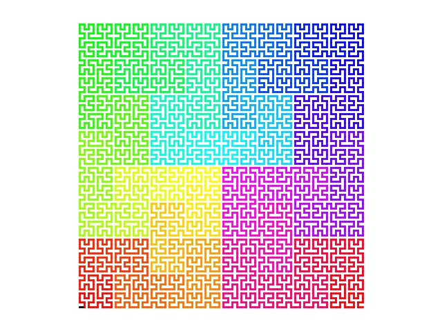
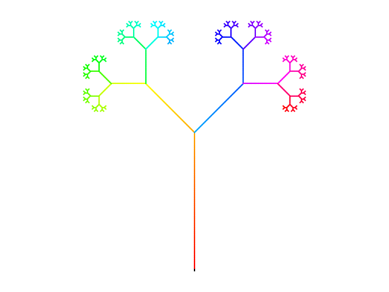
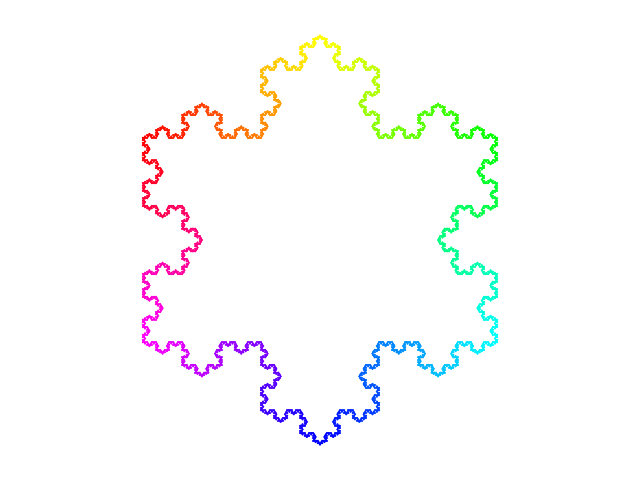

# L Systems

## Overview

This project provides a Python implementation of Lindenmayer Systems (L-Systems), a mathematical framework initially developed to study the growth patterns of simple multicellular organisms. This framework is a versatile tool for modeling and generating fractals and plant-like structures.

## Examples
Following are a few examples of fractals generated with the code, see ```examples.ipynb``` for more information and examples.









## References
"The Algorithmic Beauty of Plants" by Przemyslaw Prusinkiewicz and Aristid Lindenmayer