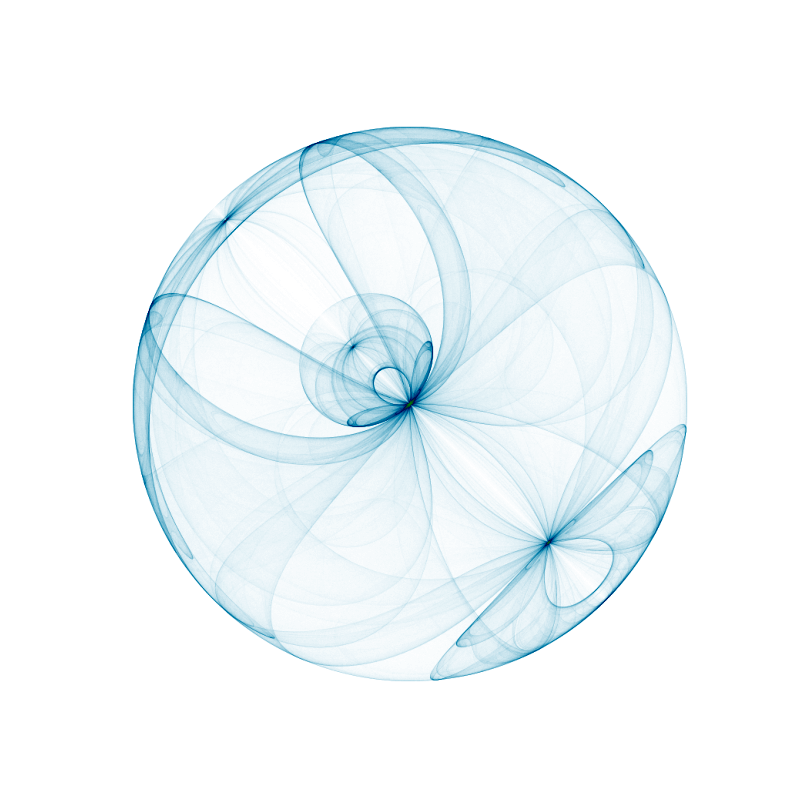

# Fractal Forest

## Overview
This project explores generation algorithms and visualization of various fractal structures. 

### L Systems

Python implementation of Lindenmayer Systems (L-Systems), a mathematical framework initially developed to study the growth patterns of simple multicellular organisms. This framework is a versatile tool for modeling and generating fractals and plant-like structures.

    
    

#### References
"The Algorithmic Beauty of Plants" by Przemyslaw Prusinkiewicz and Aristid Lindenmayer

### Strange Attractors and Chaos Games

Python implementation for generating and visualizing **Strange Attractors** and the **Chaos Games**. This implementation leverages PyTorch for efficient computations.

    
    

