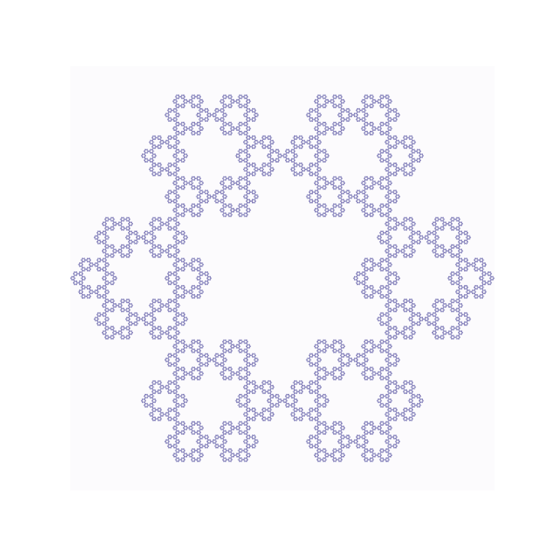

# Strange Attractors and Chaos Games

## Overview

This project provides a Python implementation for generating and visualizing **Strange Attractors** and the **Chaos Games**. This implementation leverages PyTorch for efficient computations.

## Examples
Following are a few examples generated with the code, see ```examples.ipynb``` for more information and examples.

<p float="left">
    
    
</p>
<p float="left">
    
    
</p>